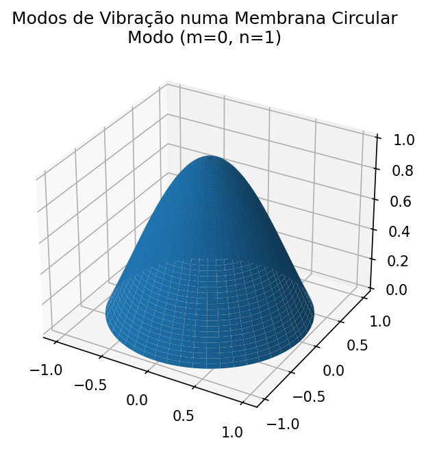
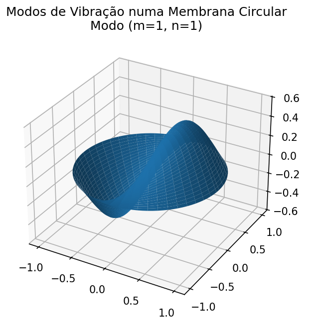

# Modos-de-vibracao-em-uma-membrana-circular

### Projeto de computação científica para visualizar os modos de vibração em uma membrana circular

  
  
  

### Contexto Físico

Este projeto visualiza os modos normais de vibração de uma membrana circular. A forma dessas ondas estacionárias é descrita pela **Equação de Helmholtz**, que, em coordenadas polares, leva à **Equação de Bessel** para a parte radial $R(r)$.

A solução geral para a parte radial é uma combinação linear das funções de Bessel de primeira ($J_m$) e segunda ($Y_m$) espécie. No entanto, nosso problema físico impõe duas **condições de contorno**:

1.  **Centro (r=0):** A amplitude da vibração deve ser finita (bem comportada). Como a função $Y_m$ diverge (explode) em $r=0$, seu coeficiente na solução deve ser zero para evitar uma amplitude infinita.
2.  **Borda (r=a):** A membrana está presa, logo, a amplitude de oscilação deve ser nula.

A primeira condição nos força a usar apenas a solução $R(r) = J_m(kr)$, onde $m$ é o índice angular (vindo da solução $\cos(m\theta)$).

A segunda condição impõe que a solução deve ser zero na borda, ou seja:
$$R(a) = J_m(k \cdot a) = 0$$

Isso significa que o produto $ka$ não pode ter qualquer valor; ele deve ser exatamente um dos **zeros** (raízes) da função $J_m$.

Assim, as vibrações ocorrem em "modos" específicos, indexados por $(m, n)$:
* **$m$** (índice angular) define a ordem da função $J_m$ a ser usada.
* **$n$** (índice radial) define qual zero (raiz) daquela função $J_m$ estamos usando para encontrar o valor de $k$.

### Como Executar

Este projeto requer Python 3 e algumas bibliotecas científicas.

**1. Pré-requisitos (Bibliotecas)**

Você pode instalar todas as dependências necessárias usando `pip`:

pip install numpy matplotlib scipy
